# Othello
This project is an AI playing Othello, the infamous board game that no one played before this TP. It is done for the Artificial intelligence course, chapter "MinMax"

# Existing base
The project already has a fully functionnal GUI and two exemples AIs.
* The GUI and the controller are not modified AT ALL
* The IA_STUB is kept as an exemple of the base AI implamentation
* The Othello_OHU is modified to host our newly done Despacito'thello

The othello OHU had some functions to specify the rules of othello such as playMove, that flipped the pawns, or getPossibleMove, that calculated the next possible moves. These functions are not specifically related to the AI - they have been kept to gain time and avoid errors on othello rules.\

The MinMax AI is based on a multiple rounds ahead calculation - it needs to "play" rounds in its head without impacting the game board. The only addition to those functions has been the addition of a "field" parameter, which defaults to the game board.\
\
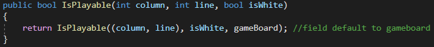\
_before : according to interface, with board by default_\
\
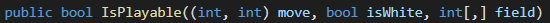\
_after : function using the field and used by the interface gateway & AI_\
\
The AI can then uses these to get he possible moves and to play the moves on fields that are not the game board, but intermediate, fictive boards.

# Despacito'thello
Despacito'tello is an AI using MinMax. Its code is located on the Othello_OHU/ArcOthello_Despacito.cs file, and is accessible by opening the Othello.sln project.\
This project uses the regions. Regions are basic, sementic compartementalization of the code.\
\
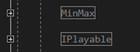
* The iplayable region is mostly intact, excepted for the field parameter seen before. The getnextmove also uses the minmax algorithm instead of the flipbits one
* The minmax region is where the interesting things happens : MinMax algorithm & heuristic calculations are there

## Heuristic function
The heuristic function represents the evaluation of the board used by the minmax algorithm to know which move is the best one.\
The othello game has been subject to a number of studies as to how to implement a good, winning algorithm. Two methods are predominant to calculate the value of a board :
* Static : A static analysis, that grants weights to some cases (positive or negative) according to known strategies. This board never changes, hence the static qualitication
* Dynamic : A dynamic analysis, that studies the field and yields values according to different characteristics, such as mobility, stability of pawns, etc... Those are dynamics because the value of a pawn is directly linked to its neighbooring pawns.

The Despacito'Thello tries to use both approaches to refine its results. The static analysis is very good as a catch-all, but lacks subtility, notably in the end of the game where the strategies become less relevant and the count of pawn become critical. The dynamic analysis is more complexe to put in place, and is composed of different sub-strategies that have to be weighted - that is not an easy task. This ratio balancing has a tendency to make the AI globally very strong against another AI and less balanced against others, trapping itself in an optimisation combat. The combination of the two yields an AI that is more versatile but keep some teeth.
### Static
The static analysis is done using a bord of values. This board mimic the bord of the game.\
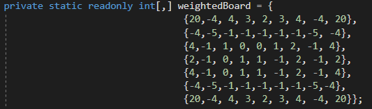
\
The calculation of the static value is very simple : If a case is taken by the player, the value is added. If it is an opponent, the value is substracted. This final sum is the value of the board.\
\
The board is constructed using standard othello strategies : The corner are the angular key points of the board. They are valued a lot.\
To be able to place a pawn at the border, another ennemy pawn must be adjacent to it. placing a pawn here is then considered very bad (negative value). To work, the positive value of the corner __must__ be greater than the combined negative values, otherwise the AI will try to conceed the entire corner and see it as a good thing.\
\
According to this same pattern of in-out-in-out, the values are positive, negative, etc... alternatively from the corner to the center in concentric circles.\
the static board is not fully symetrical because the game board isn't either.

### Dynamic
The dynamic analysis is done using 4 parameters of the ongoing game :
* Mobility, which is the numbers of moves of the player and the opponnent. As Othello forces a player to pass its turn upon having no legal move, a common and very strong strategy is a starvation through mobility - called "betonnage", in the fabulous french language (try it, it's awesome).
* Stability : The stability of the board represents the danger of pawns to be flipped by the opponent. This stability can be constructed using different algorithm - we choose corners and borders.
* Parity : This is a simple count of the pawns. It is not the best parameter to observe, but it is still important - and its importance grows as the game goes on

These algorithm yields a ratio c [-1;1]. These ratios are multiplied by a factor to weight them. The combined ratio is normalized, and gives a booster c [-1;1].\
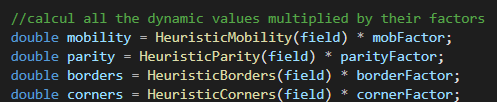
\
\
The problem lies within the fact that the static world has an arbitrary values, wherehas the dynamic world can be - and is effectively - normalized. The combination of the worlds is done using the static world as a __base value__, and the dynamic world as a __booster__, or __helper__, that modifies this base value - either by boosting it or by minimizing it.\
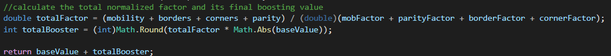
\
The static world stays the master of the heuristic, and the dynamic functions help give an additional help. The dynamic total booster can be positive or negative, and is multiplied by the absolute value of the static board value. As such, the booster is positive if it consider the game as positive, wherehas the booster is negative if it consider the game as currently negative. As the ratio is contained between [-1;1], the booster will never transform a base value from/to positive to/from negative.

#### Mobility
The mobility of the game represents the ability of the player to play opposed to the ability of the opponent to play.\
It is one of the -if not THE- most important value to take care of. The betonnage strategy is very strong and often leads to victories.\
\
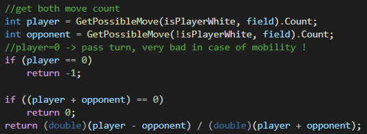\
__mobility heuristic__
\
\
The yielded value is very simple :
* If the player has no move, he will pass his turn - very bad, return -1
* If the player and the opponent have no move, return 0 to avoid division by 0
* Return the ratio (delta(move)/total(move)), which is within our bounds.

#### Stability
In Othello, a pawn is never trully "yours" - it can be flipped any time. Well, not all pawns can be : they need to be surrounded by 2 ennemy pawns to be flipped. The dangerosity to be flipped is called "pawn stability" - how much "my pawn" is this pawn ?\
There are some complexe algorithm that look at the neighbooring of each pawn to determine their stability value. Despacito uses a more straight-forward take.\
This strategy is composed of two sub-strategies : Corners, the most important one, and corners.
##### Corners
The pawn at the corner of the board are literally the more stable in the game. They can never be captured from the moment they are placed. They are great indicators of the state of the game, and the best AI will fight for them.\
The calcul of this heuristic is very simple :
* Calculate the number of borders of the player and the opponent
* Yields the ratio corresponding to this difference : delta(corners)/total(corners)

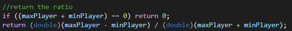\
__corners heuristic__

##### Borders
The borders represent the horizontal & vertical bordures of the game board. These pawns are more stable than the central pawns - they can be taken only from their horizontal/vertial lines.\
As such, having __consecutive__ pawns greatly improves the stability of these border pawns.\
The heuristic calculate the consecutive pawns of the player and the opponent, and yields the ratio.\
\
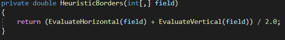\
__Border heuristic__
\
\
This function uses the horizontal and vertical subfonctions to operate. They both yield a coefficient that are equally weighted for the final value. These coefficient simply represents delta(consecutive)/total(pawns).
#### Parity
The parity is the least important factor at the beggining - going for the pawn count is a bad idea, the patterns are much more interesting. Nonetheless, this become a very strong factor at the end of the game, where the count of pawns is the decisive indicator of a win.\
The parity heuristic is very simple - who has the most pawns ? And yields the delta(pawns)/total(pawns).\

### Balancing
Balancing the ratio is a difficult exercice. Much more difficult if we consider the possibility of changing the ratios according to the state of the game. We found this combination of ratio by trial-and-error and defined two game states :
* The standard balance, which takes place the majority of the game, which focus on patterns
* The late game phase, which focuses on winning the game

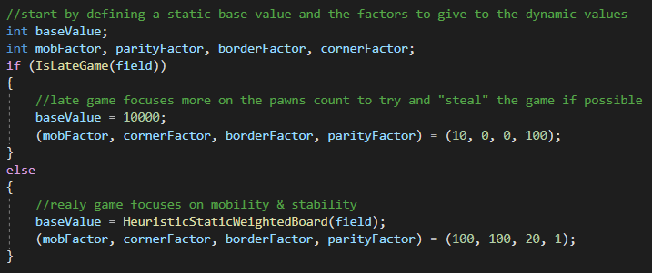\
__balance factors of the game__
\
\
During the greater portion of game, the base value is the static board (seen above). The ratios focus on mobility & strong stability, without forgetting borders (less important) and neglecting parity (irrelevant in early game).\
\
The late game phase is determing by this value :\
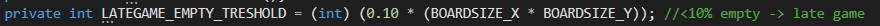\
__late game treshold factor__
\
\
Which means that at the end of the MinMax, when all the rounds have been played inside the AI's head and if the count of empty cells is less than this treshold, the game is considered in "lategame" phase. At this point, the static board does fixed base value is big enough to ensure that the ratios (that can be little) yields a correct integer value, and not 0 after the rounding.

### End game
The game is considered in "end game" if the current move ends the game - which means, there is no legal moves left to the player or the opponent. This heuristic is called when the game is over with the current move, wether we are at depth 0 or not.\
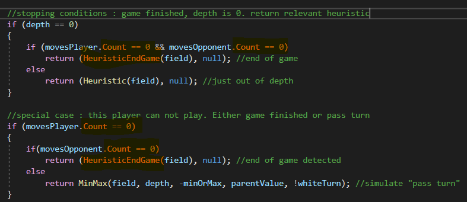\
__end game call__\
\
At this point, the game will be called either a win, a loose, or a draw. This calling __must__ override other heuristics as they are critical and final. The HeuristicEndGame assumes this responsibiltiy.\
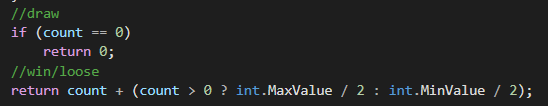\
__end game return gargantuan values__

## Implementation specificities
The MinMax algorithm is directly taken from the AI course pseudo-code. It is done as a single function, with a minOrMax parameter.\
This sections talks about the specifiities of the implementation.

### alpha-beta : parent value as nullable

### Overflow avoidance

### MinMax : Pass turn
## Testing phase
The testing phase has been compiled into a little [PDF report](Rapport_de_tests_DespacitoThello.pdf).\
It is a suit of fights against the AIs of the precedent years to see if it could hold its own against good competitors.